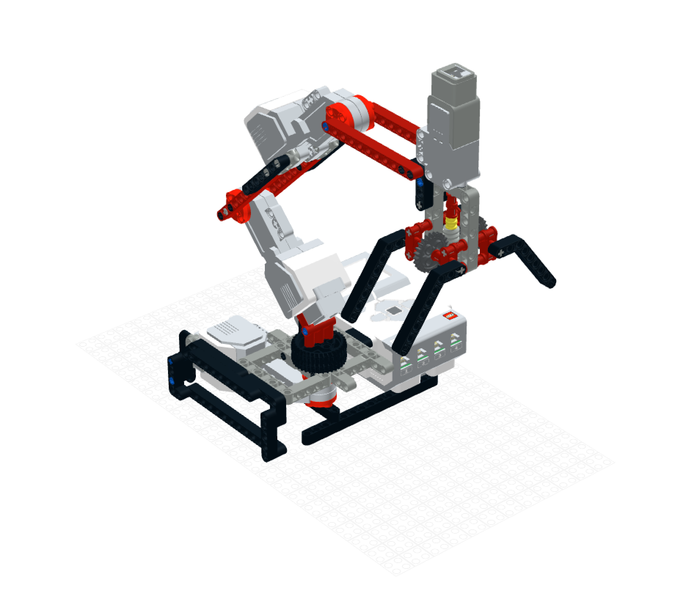

# Algorithmic Robotic Arm Control using LLMs and CV

## Project has been shelved, for now

What happened? Physical limitations of the lego. Unfortunately, Lego parts don't hold up well when trying to build your own robot arm. They're very wobbly and hard to keep accurate. Could I keep going with this? Probably, but I found a better variation of the project that accomplishes the same goal. The math works great, though :)

Robot v1 (Designed in Lego Studio)
